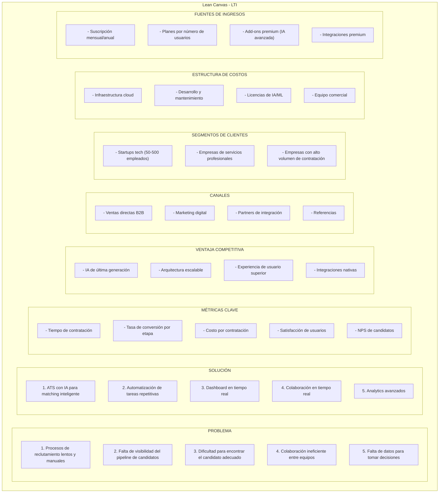
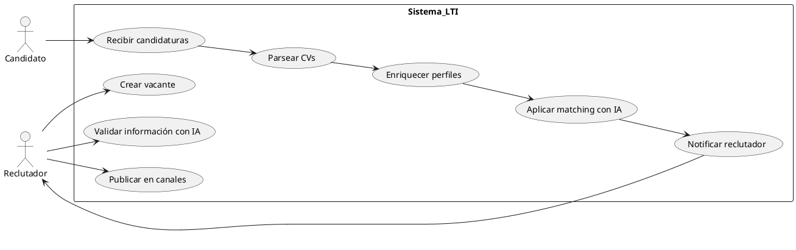
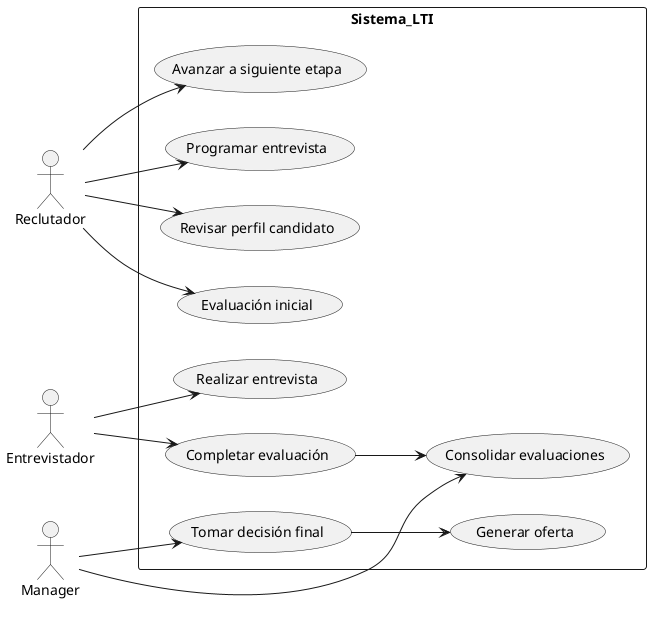
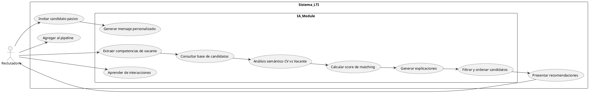
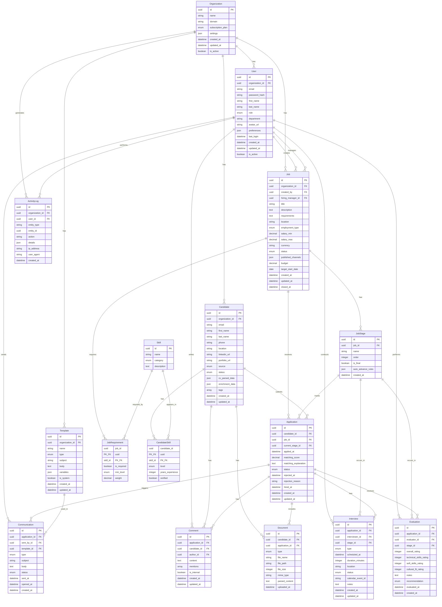
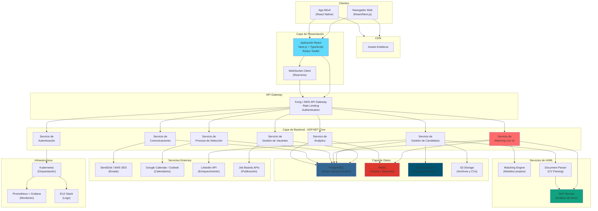
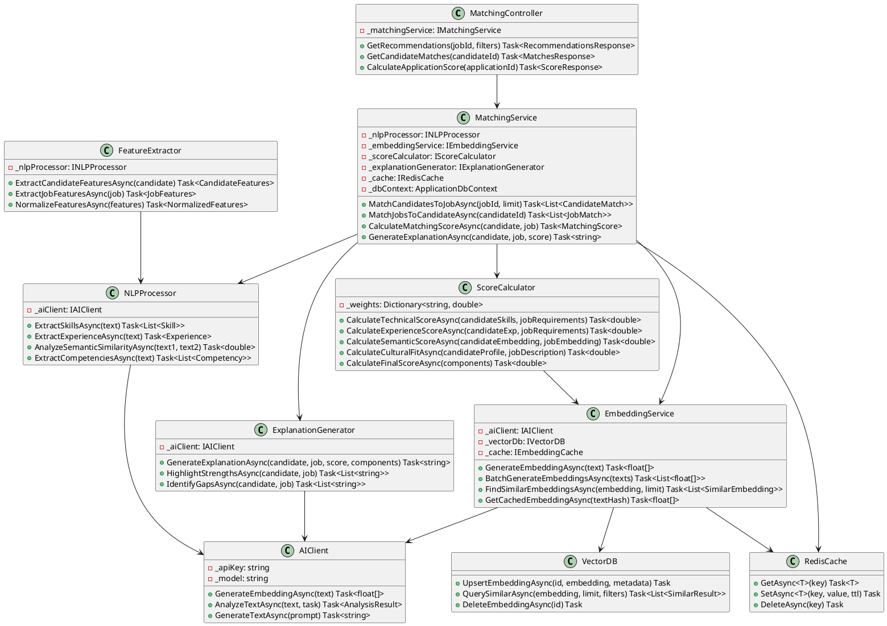
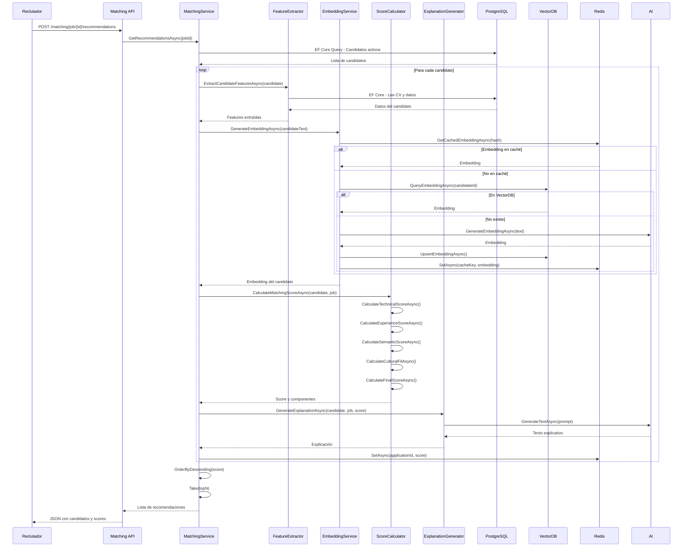

# Documentación del Sistema ATS - LTI

## 1. Descripción del Software LTI

### 1.1. Descripción Breve

**LTI (Leading Talent Intelligence)** es un sistema ATS (Applicant Tracking System) de nueva generación diseñado para revolucionar la gestión del talento en las organizaciones modernas. LTI combina inteligencia artificial, automatización avanzada y una experiencia de usuario excepcional para transformar el proceso de reclutamiento desde la publicación de vacantes hasta la incorporación de candidatos.

El sistema está construido con tecnologías modernas (React para el frontend y .NET con ASP.NET Core para el backend) que garantizan escalabilidad, rendimiento y una experiencia fluida tanto para reclutadores como para candidatos.

### 1.2. Valor Añadido

LTI ofrece un valor diferenciado a través de:

- **Inteligencia Artificial Integrada**: Utiliza modelos de IA para el análisis automático de CVs, matching inteligente entre candidatos y posiciones, y generación automática de preguntas de entrevista personalizadas.

- **Colaboración en Tiempo Real**: Sistema de comentarios, notificaciones instantáneas y flujos de trabajo colaborativos que permiten a equipos distribuidos trabajar de manera eficiente.

- **Automatización Inteligente**: Automatización de tareas repetitivas como envío de emails, programación de entrevistas, seguimiento de candidatos y generación de reportes.

- **Experiencia del Candidato Superior**: Portal de candidatos intuitivo, seguimiento transparente del estado de su aplicación y comunicación bidireccional fluida.

- **Analytics y Reportes Avanzados**: Dashboards en tiempo real con métricas clave del proceso de reclutamiento, análisis predictivo de tiempo de contratación y ROI de canales de reclutamiento.

### 1.3. Ventajas Competitivas

1. **IA de Última Generación**: Integración de modelos de lenguaje avanzados para análisis semántico de CVs y matching contextual, no solo basado en palabras clave.

2. **Arquitectura Moderna y Escalable**: Construido con tecnologías cloud-native que permiten escalar automáticamente según la demanda, reduciendo costos operativos.

3. **Integración Nativa con Ecosistema HR**: APIs robustas para integración con sistemas de nómina, HRIS, plataformas de evaluación y herramientas de comunicación.

4. **Personalización Extrema**: Sistema de workflows configurables que permite a cada organización adaptar el proceso a sus necesidades específicas sin requerir desarrollo personalizado.

5. **Seguridad y Cumplimiento**: Cumplimiento automático con GDPR, normativas locales de protección de datos y estándares de seguridad empresarial (SOC 2, ISO 27001).

6. **Mobile-First**: Aplicación móvil nativa que permite a los reclutadores gestionar el proceso desde cualquier lugar.

### 1.4. Funciones Principales

#### Gestión de Vacantes
- Creación y publicación de posiciones en múltiples canales (job boards, redes sociales, página web corporativa)
- Gestión de múltiples versiones de una misma vacante
- Configuración de requisitos y competencias requeridas
- Presupuesto y tracking de costos por vacante

#### Gestión de Candidatos
- Base de datos centralizada de candidatos con búsqueda avanzada
- Parsing automático de CVs en múltiples formatos (PDF, Word, texto)
- Enriquecimiento automático de perfiles con datos de LinkedIn y otras fuentes
- Sistema de tags y notas personalizadas
- Historial completo de interacciones

#### Matching Inteligente con IA
- Análisis semántico de CVs vs. descripción de puesto
- Scoring automático de candidatos (0-100)
- Recomendaciones de candidatos para nuevas posiciones basadas en historial
- Detección de candidatos pasivos que podrían ser adecuados

#### Proceso de Selección
- Pipeline configurable por vacante (etapas personalizables)
- Sistema de evaluación y feedback estructurado
- Programación automática de entrevistas con sincronización de calendarios
- Evaluaciones técnicas integradas (coding challenges, tests de personalidad)
- Sistema de votación y consenso entre entrevistadores

#### Colaboración y Comunicación
- Comentarios y @menciones en tiempo real
- Notificaciones push y por email configurables
- Chat integrado entre miembros del equipo
- Compartir candidatos entre diferentes posiciones
- Sistema de aprobaciones y permisos granulares

#### Automatización
- Respuestas automáticas a candidatos según etapa del proceso
- Recordatorios automáticos para entrevistadores
- Auto-rechazo basado en criterios configurables
- Auto-avance de candidatos según triggers definidos
- Integración con calendarios para programación automática

#### Analytics y Reportes
- Dashboard ejecutivo con KPIs principales
- Tiempo promedio de contratación por posición y departamento
- Tasa de conversión por etapa del pipeline
- Análisis de canales de reclutamiento más efectivos
- Reportes personalizables y exportables
- Predicción de tiempo de contratación usando ML

#### Portal del Candidato
- Aplicación online intuitiva
- Seguimiento del estado de aplicación en tiempo real
- Subida de documentos y portafolio
- Completar evaluaciones y cuestionarios
- Comunicación directa con reclutadores

### 1.5. Lean Canvas



## 2. Casos de Uso Principales

### 2.1. Caso de Uso 1: Publicar Vacante y Recibir Candidaturas

**Descripción**: Un reclutador necesita publicar una nueva posición vacante en múltiples canales y gestionar las candidaturas recibidas de manera eficiente.

**Actor Principal**: Reclutador

**Precondiciones**: 
- El reclutador tiene una cuenta activa en LTI
- Tiene permisos para crear vacantes
- Existe al menos un template de vacante configurado

**Flujo Principal**:

1. El reclutador accede al sistema y selecciona "Crear Nueva Vacante"
2. El sistema muestra un formulario con campos: título, descripción, requisitos, competencias, ubicación, tipo de contrato, rango salarial
3. El reclutador completa la información o selecciona un template predefinido
4. El sistema valida la información y sugiere mejoras usando IA (optimización de palabras clave, claridad de descripción)
5. El reclutador selecciona los canales de publicación (job boards, redes sociales, página web)
6. El sistema publica automáticamente la vacante en los canales seleccionados
7. Los candidatos comienzan a aplicar a través del portal o enviando CVs
8. El sistema recibe las candidaturas y parsea automáticamente los CVs
9. El sistema enriquece los perfiles con datos adicionales (LinkedIn, etc.)
10. El sistema aplica matching con IA y asigna un score inicial a cada candidato
11. El sistema notifica al reclutador de nuevas candidaturas con scores destacados
12. El reclutador puede revisar candidatos ordenados por score o criterios personalizados

**Flujos Alternativos**:

- **2a. Uso de Template**: Si el reclutador selecciona un template, el sistema pre-llena los campos y el reclutador solo ajusta detalles específicos.
- **4a. Rechazo de Sugerencias**: El reclutador puede ignorar las sugerencias de IA y continuar con su versión.
- **8a. CV No Parseable**: Si el sistema no puede parsear un CV, lo marca para revisión manual y notifica al reclutador.
- **10a. Sin Datos Adicionales**: Si no se encuentran datos adicionales, el sistema continúa solo con la información del CV.

**Postcondiciones**:
- La vacante está publicada en los canales seleccionados
- Las candidaturas recibidas están parseadas y enriquecidas
- Los candidatos tienen scores de matching asignados
- El reclutador tiene visibilidad completa del pipeline

**Diagrama de Caso de Uso**:



### 2.2. Caso de Uso 2: Evaluar y Avanzar Candidatos en el Pipeline

**Descripción**: Un equipo de reclutamiento colabora para evaluar candidatos, realizar entrevistas y avanzarlos a través de las diferentes etapas del proceso de selección hasta llegar a una decisión final.

**Actor Principal**: Reclutador, Manager, Entrevistador

**Precondiciones**:
- Existe al menos una vacante activa con candidatos en el pipeline
- Los usuarios tienen permisos para evaluar candidatos
- El pipeline de la vacante está configurado con etapas definidas

**Flujo Principal**:

1. El reclutador accede al pipeline de una vacante y visualiza candidatos por etapa
2. El reclutador selecciona un candidato para revisar su perfil completo
3. El sistema muestra: CV parseado, score de matching, historial de interacciones, notas previas, evaluaciones anteriores
4. El reclutador realiza una evaluación inicial y añade comentarios
5. Si el candidato pasa la evaluación inicial, el reclutador lo avanza a la siguiente etapa (ej: "Entrevista Telefónica")
6. El sistema notifica automáticamente al candidato del cambio de estado
7. El reclutador programa una entrevista usando el sistema de calendario integrado
8. El sistema envía invitaciones de calendario a entrevistador y candidato
9. El entrevistador realiza la entrevista y completa un formulario de evaluación estructurado
10. El entrevistador añade notas, califica competencias y proporciona feedback
11. El sistema agrega la evaluación al perfil del candidato
12. Si hay múltiples entrevistadores, el sistema consolida las evaluaciones
13. El manager revisa todas las evaluaciones y toma una decisión (avanzar, rechazar, mantener en espera)
14. Si se decide avanzar, el candidato pasa a la etapa final (ej: "Oferta")
15. El sistema genera automáticamente una oferta basada en templates y la envía al candidato
16. El sistema actualiza el dashboard con las métricas del proceso

**Flujos Alternativos**:

- **5a. Rechazo Temprano**: Si el candidato no pasa la evaluación inicial, el reclutador lo marca como rechazado y el sistema envía un email automático de rechazo.
- **7a. Entrevista Automática**: El sistema puede sugerir horarios disponibles basados en las preferencias del candidato y la disponibilidad del entrevistador.
- **9a. Entrevista Cancelada**: Si se cancela una entrevista, el sistema notifica a ambas partes y sugiere nuevos horarios.
- **13a. Desempate Necesario**: Si hay desacuerdo entre entrevistadores, el sistema puede activar un proceso de revisión adicional o escalar al manager.
- **15a. Negociación de Oferta**: Si el candidato negocia términos, el sistema permite múltiples iteraciones de la oferta.

**Postcondiciones**:
- El candidato está en una nueva etapa del pipeline o ha sido rechazado
- Todas las evaluaciones están registradas en el sistema
- Las métricas del proceso están actualizadas
- Los stakeholders relevantes han sido notificados

**Diagrama de Caso de Uso**:



### 2.3. Caso de Uso 3: Aplicar Matching Inteligente y Recomendaciones con IA

**Descripción**: El sistema utiliza inteligencia artificial para analizar candidatos existentes en la base de datos y recomendar los mejores matches para nuevas posiciones, así como sugerir candidatos pasivos que podrían ser adecuados.

**Actor Principal**: Sistema (IA), Reclutador

**Precondiciones**:
- Existe una base de datos con candidatos históricos
- Se ha creado una nueva vacante con descripción y requisitos detallados
- El módulo de IA está activo y configurado

**Flujo Principal**:

1. El reclutador crea una nueva vacante y completa la descripción, requisitos y competencias requeridas
2. El sistema extrae automáticamente las competencias clave, nivel de experiencia, tecnologías y soft skills de la descripción usando NLP
3. El sistema consulta la base de datos de candidatos (activos y pasivos)
4. Para cada candidato, el sistema ejecuta el motor de matching que:
   - Analiza semánticamente el CV del candidato vs. la descripción de la vacante
   - Compara competencias técnicas requeridas vs. competencias del candidato
   - Evalúa nivel de experiencia y seniority
   - Considera historial de aplicaciones previas y resultados
   - Analiza fit cultural basado en preferencias y valores
5. El sistema calcula un score de matching (0-100) para cada candidato
6. El sistema genera explicaciones de por qué cada candidato es un buen match (fortalezas destacadas)
7. El sistema ordena los candidatos por score y filtra aquellos con score > 70
8. El sistema presenta al reclutador una lista de candidatos recomendados con:
   - Score de matching
   - Explicación del match
   - Estado actual (activo, pasivo, rechazado previamente)
   - Última interacción
9. El reclutador revisa las recomendaciones y puede:
   - Ver detalles completos de cada candidato
   - Aplicar filtros adicionales (ubicación, disponibilidad, etc.)
   - Invitar candidatos pasivos a aplicar
   - Agregar candidatos directamente al pipeline
10. Si el reclutador invita a un candidato pasivo, el sistema genera un mensaje personalizado usando IA
11. El sistema aprende de las acciones del reclutador para mejorar futuras recomendaciones

**Flujos Alternativos**:

- **2a. Descripción Incompleta**: Si la descripción es muy breve, el sistema solicita más información o usa datos de vacantes similares como referencia.
- **4a. Candidato Sin CV Completo**: Si un candidato no tiene CV pero tiene perfil en LinkedIn, el sistema usa esos datos para el matching.
- **7a. Pocos Matches**: Si hay menos de 5 candidatos con score > 70, el sistema baja el threshold a 60 y notifica al reclutador.
- **9a. Rechazo de Recomendación**: Si el reclutador rechaza una recomendación, el sistema aprende y ajusta el modelo para futuras recomendaciones similares.
- **10a. Personalización Manual**: El reclutador puede editar el mensaje generado por IA antes de enviarlo.

**Postcondiciones**:
- El sistema ha generado una lista de candidatos recomendados con scores
- El reclutador tiene visibilidad de los mejores matches
- Los candidatos pasivos han sido identificados y pueden ser contactados
- El modelo de IA ha aprendido de las interacciones del reclutador

**Diagrama de Caso de Uso**:



## 3. Modelo de Datos

### 3.1. Descripción General

El modelo de datos de LTI está diseñado para soportar un sistema multi-tenant que permite a múltiples organizaciones gestionar sus procesos de reclutamiento de manera independiente. El modelo incluye entidades para gestión de usuarios, vacantes, candidatos, procesos de selección, evaluaciones, comunicaciones y analytics.

### 3.2. Entidades Principales

#### 3.2.1. Organization (Organización)
Representa una empresa cliente que usa el sistema.

**Atributos**:
- `id` (UUID, PK): Identificador único de la organización
- `name` (String, 255): Nombre de la organización
- `domain` (String, 100): Dominio de email corporativo
- `subscription_plan` (Enum): Plan de suscripción (Basic, Professional, Enterprise)
- `settings` (JSON): Configuraciones personalizadas de la organización
- `created_at` (DateTime): Fecha de creación
- `updated_at` (DateTime): Fecha de última actualización
- `is_active` (Boolean): Indica si la organización está activa

#### 3.2.2. User (Usuario)
Representa a un usuario del sistema (reclutador, manager, entrevistador, etc.).

**Atributos**:
- `id` (UUID, PK): Identificador único del usuario
- `organization_id` (UUID, FK → Organization): Organización a la que pertenece
- `email` (String, 255, Unique): Email del usuario
- `password_hash` (String, 255): Hash de la contraseña
- `first_name` (String, 100): Nombre
- `last_name` (String, 100): Apellido
- `role` (Enum): Rol del usuario (Admin, Recruiter, Manager, Interviewer, Viewer)
- `department` (String, 100): Departamento
- `avatar_url` (String, 500): URL del avatar
- `preferences` (JSON): Preferencias de usuario (notificaciones, tema, etc.)
- `last_login` (DateTime): Último inicio de sesión
- `created_at` (DateTime): Fecha de creación
- `updated_at` (DateTime): Fecha de última actualización
- `is_active` (Boolean): Indica si el usuario está activo

#### 3.2.3. Job (Vacante)
Representa una posición de trabajo abierta.

**Atributos**:
- `id` (UUID, PK): Identificador único de la vacante
- `organization_id` (UUID, FK → Organization): Organización propietaria
- `created_by` (UUID, FK → User): Usuario que creó la vacante
- `title` (String, 255): Título del puesto
- `description` (Text): Descripción completa del puesto
- `requirements` (Text): Requisitos del puesto
- `location` (String, 255): Ubicación (ciudad, país, remoto)
- `employment_type` (Enum): Tipo de contrato (Full-time, Part-time, Contract, Internship)
- `salary_min` (Decimal, 10,2): Salario mínimo
- `salary_max` (Decimal, 10,2): Salario máximo
- `currency` (String, 3): Moneda (USD, EUR, etc.)
- `status` (Enum): Estado (Draft, Published, Closed, Archived)
- `published_channels` (JSON): Canales donde está publicada
- `budget` (Decimal, 10,2): Presupuesto asignado
- `hiring_manager_id` (UUID, FK → User): Manager responsable
- `target_start_date` (Date): Fecha objetivo de inicio
- `created_at` (DateTime): Fecha de creación
- `updated_at` (DateTime): Fecha de última actualización
- `closed_at` (DateTime): Fecha de cierre

#### 3.2.4. JobStage (Etapa del Pipeline)
Representa una etapa en el proceso de selección de una vacante.

**Atributos**:
- `id` (UUID, PK): Identificador único de la etapa
- `job_id` (UUID, FK → Job): Vacante asociada
- `name` (String, 100): Nombre de la etapa (ej: "Screening", "Entrevista Técnica")
- `order` (Integer): Orden en el pipeline
- `is_final` (Boolean): Indica si es etapa final (Oferta, Rechazado)
- `auto_advance_rules` (JSON): Reglas de avance automático
- `created_at` (DateTime): Fecha de creación

#### 3.2.5. Candidate (Candidato)
Representa a un candidato en el sistema.

**Atributos**:
- `id` (UUID, PK): Identificador único del candidato
- `organization_id` (UUID, FK → Organization): Organización (para multi-tenant)
- `email` (String, 255): Email del candidato
- `first_name` (String, 100): Nombre
- `last_name` (String, 100): Apellido
- `phone` (String, 50): Teléfono
- `location` (String, 255): Ubicación
- `linkedin_url` (String, 500): URL de LinkedIn
- `portfolio_url` (String, 500): URL de portafolio
- `source` (Enum): Origen (Job Board, Referral, Direct, LinkedIn, etc.)
- `status` (Enum): Estado general (Active, Passive, Rejected, Hired)
- `cv_parsed_data` (JSON): Datos extraídos del CV (experiencia, educación, skills)
- `enrichment_data` (JSON): Datos enriquecidos de fuentes externas
- `tags` (Array<String>): Tags personalizados
- `created_at` (DateTime): Fecha de creación
- `updated_at` (DateTime): Fecha de última actualización

#### 3.2.6. Application (Aplicación)
Representa la aplicación de un candidato a una vacante específica.

**Atributos**:
- `id` (UUID, PK): Identificador único de la aplicación
- `candidate_id` (UUID, FK → Candidate): Candidato
- `job_id` (UUID, FK → Job): Vacante
- `current_stage_id` (UUID, FK → JobStage): Etapa actual en el pipeline
- `applied_at` (DateTime): Fecha de aplicación
- `matching_score` (Decimal, 5,2): Score de matching con IA (0-100)
- `matching_explanation` (Text): Explicación del score
- `status` (Enum): Estado (Applied, Screening, Interview, Offer, Rejected, Withdrawn)
- `rejected_at` (DateTime): Fecha de rechazo
- `rejection_reason` (String, 500): Razón de rechazo
- `hired_at` (DateTime): Fecha de contratación
- `created_at` (DateTime): Fecha de creación
- `updated_at` (DateTime): Fecha de última actualización

#### 3.2.7. Document (Documento)
Representa documentos asociados a candidatos (CVs, portafolios, etc.).

**Atributos**:
- `id` (UUID, PK): Identificador único del documento
- `candidate_id` (UUID, FK → Candidate): Candidato propietario
- `application_id` (UUID, FK → Application, Nullable): Aplicación asociada (si aplica)
- `type` (Enum): Tipo (CV, Cover Letter, Portfolio, Certificate, Other)
- `file_name` (String, 255): Nombre del archivo original
- `file_path` (String, 500): Ruta del archivo en storage
- `file_size` (Integer): Tamaño en bytes
- `mime_type` (String, 100): Tipo MIME
- `parsed_content` (Text): Contenido extraído (para búsqueda)
- `uploaded_at` (DateTime): Fecha de subida

#### 3.2.8. Evaluation (Evaluación)
Representa una evaluación realizada por un entrevistador o reclutador.

**Atributos**:
- `id` (UUID, PK): Identificador único de la evaluación
- `application_id` (UUID, FK → Application): Aplicación evaluada
- `evaluator_id` (UUID, FK → User): Usuario que realiza la evaluación
- `stage_id` (UUID, FK → JobStage): Etapa en la que se realiza
- `overall_rating` (Integer): Calificación general (1-5)
- `technical_skills_rating` (Integer): Calificación habilidades técnicas (1-5)
- `soft_skills_rating` (Integer): Calificación habilidades blandas (1-5)
- `cultural_fit_rating` (Integer): Calificación fit cultural (1-5)
- `notes` (Text): Notas y comentarios
- `recommendation` (Enum): Recomendación (Strong Yes, Yes, Maybe, No, Strong No)
- `evaluated_at` (DateTime): Fecha de evaluación
- `created_at` (DateTime): Fecha de creación

#### 3.2.9. Interview (Entrevista)
Representa una entrevista programada o realizada.

**Atributos**:
- `id` (UUID, PK): Identificador único de la entrevista
- `application_id` (UUID, FK → Application): Aplicación asociada
- `interviewer_id` (UUID, FK → User): Entrevistador
- `stage_id` (UUID, FK → JobStage): Etapa del proceso
- `type` (Enum): Tipo (Phone, Video, On-site, Technical)
- `scheduled_at` (DateTime): Fecha y hora programada
- `duration_minutes` (Integer): Duración en minutos
- `location` (String, 255): Ubicación o link de video
- `status` (Enum): Estado (Scheduled, Completed, Cancelled, No-show)
- `calendar_event_id` (String, 255): ID del evento en calendario externo
- `notes` (Text): Notas de la entrevista
- `created_at` (DateTime): Fecha de creación
- `updated_at` (DateTime): Fecha de última actualización

#### 3.2.10. Comment (Comentario)
Representa comentarios y notas en aplicaciones o candidatos.

**Atributos**:
- `id` (UUID, PK): Identificador único del comentario
- `application_id` (UUID, FK → Application, Nullable): Aplicación (si aplica)
- `candidate_id` (UUID, FK → Candidate, Nullable): Candidato (si aplica)
- `author_id` (UUID, FK → User): Autor del comentario
- `content` (Text): Contenido del comentario
- `mentions` (Array<UUID>): IDs de usuarios mencionados
- `is_internal` (Boolean): Indica si es comentario interno (no visible para candidato)
- `created_at` (DateTime): Fecha de creación
- `updated_at` (DateTime): Fecha de última actualización

#### 3.2.11. Communication (Comunicación)
Representa comunicaciones enviadas a candidatos (emails, mensajes).

**Atributos**:
- `id` (UUID, PK): Identificador único de la comunicación
- `application_id` (UUID, FK → Application): Aplicación asociada
- `sent_by_id` (UUID, FK → User): Usuario que envió
- `type` (Enum): Tipo (Email, SMS, In-app)
- `subject` (String, 255): Asunto
- `body` (Text): Cuerpo del mensaje
- `template_id` (UUID, FK → Template, Nullable): Template usado (si aplica)
- `status` (Enum): Estado (Draft, Sent, Delivered, Opened, Bounced)
- `sent_at` (DateTime): Fecha de envío
- `opened_at` (DateTime): Fecha de apertura
- `created_at` (DateTime): Fecha de creación

#### 3.2.12. Template (Plantilla)
Representa plantillas de emails o mensajes reutilizables.

**Atributos**:
- `id` (UUID, PK): Identificador único de la plantilla
- `organization_id` (UUID, FK → Organization): Organización propietaria
- `name` (String, 255): Nombre de la plantilla
- `type` (Enum): Tipo (Email, SMS, Offer Letter)
- `subject` (String, 255): Asunto (para emails)
- `body` (Text): Cuerpo con variables
- `variables` (JSON): Variables disponibles
- `is_system` (Boolean): Indica si es plantilla del sistema
- `created_at` (DateTime): Fecha de creación
- `updated_at` (DateTime): Fecha de última actualización

#### 3.2.13. Skill (Competencia)
Representa competencias técnicas o blandas.

**Atributos**:
- `id` (UUID, PK): Identificador único de la competencia
- `name` (String, 100, Unique): Nombre de la competencia
- `category` (Enum): Categoría (Technical, Language, Soft Skill, Certification)
- `description` (Text): Descripción

#### 3.2.14. CandidateSkill (Competencia de Candidato)
Relación muchos-a-muchos entre candidatos y competencias.

**Atributos**:
- `candidate_id` (UUID, FK → Candidate, PK): Candidato
- `skill_id` (UUID, FK → Skill, PK): Competencia
- `level` (Enum): Nivel (Beginner, Intermediate, Advanced, Expert)
- `years_experience` (Integer): Años de experiencia
- `verified` (Boolean): Indica si está verificado

#### 3.2.15. JobRequirement (Requisito de Vacante)
Relación muchos-a-muchos entre vacantes y competencias requeridas.

**Atributos**:
- `job_id` (UUID, FK → Job, PK): Vacante
- `skill_id` (UUID, FK → Skill, PK): Competencia
- `is_required` (Boolean): Indica si es requerida o deseable
- `min_level` (Enum): Nivel mínimo requerido
- `weight` (Decimal, 3,2): Peso en el cálculo de matching (0-1)

#### 3.2.16. ActivityLog (Log de Actividad)
Registro de todas las actividades en el sistema para auditoría y analytics.

**Atributos**:
- `id` (UUID, PK): Identificador único
- `organization_id` (UUID, FK → Organization): Organización
- `user_id` (UUID, FK → User, Nullable): Usuario que realizó la acción
- `entity_type` (String, 50): Tipo de entidad afectada (Application, Candidate, Job, etc.)
- `entity_id` (UUID): ID de la entidad
- `action` (String, 50): Acción realizada (Created, Updated, Deleted, Status Changed)
- `details` (JSON): Detalles de la acción
- `ip_address` (String, 45): Dirección IP
- `user_agent` (String, 500): User agent del navegador
- `created_at` (DateTime): Fecha de la actividad

### 3.3. Relaciones

1. **Organization → User**: Una organización tiene muchos usuarios (1:N)
2. **Organization → Job**: Una organización tiene muchas vacantes (1:N)
3. **Organization → Candidate**: Una organización tiene muchos candidatos (1:N)
4. **User → Job (created_by)**: Un usuario puede crear muchas vacantes (1:N)
5. **User → Job (hiring_manager)**: Un usuario puede ser manager de muchas vacantes (1:N)
6. **Job → JobStage**: Una vacante tiene muchas etapas (1:N)
7. **Candidate → Application**: Un candidato puede aplicar a muchas vacantes (1:N)
8. **Job → Application**: Una vacante puede tener muchas aplicaciones (1:N)
9. **Application → JobStage**: Una aplicación está en una etapa (N:1)
10. **Candidate → Document**: Un candidato puede tener muchos documentos (1:N)
11. **Application → Document**: Una aplicación puede tener documentos asociados (1:N)
12. **Application → Evaluation**: Una aplicación puede tener muchas evaluaciones (1:N)
13. **User → Evaluation**: Un usuario puede realizar muchas evaluaciones (1:N)
14. **Application → Interview**: Una aplicación puede tener muchas entrevistas (1:N)
15. **User → Interview**: Un usuario puede realizar muchas entrevistas (1:N)
16. **Application → Comment**: Una aplicación puede tener muchos comentarios (1:N)
17. **Candidate → Comment**: Un candidato puede tener muchos comentarios (1:N)
18. **User → Comment**: Un usuario puede escribir muchos comentarios (1:N)
19. **Application → Communication**: Una aplicación puede tener muchas comunicaciones (1:N)
20. **Candidate → CandidateSkill**: Un candidato tiene muchas competencias (N:M)
21. **Skill → CandidateSkill**: Una competencia pertenece a muchos candidatos (N:M)
22. **Job → JobRequirement**: Una vacante requiere muchas competencias (N:M)
23. **Skill → JobRequirement**: Una competencia es requerida por muchas vacantes (N:M)

### 3.4. Diagrama del Modelo de Datos



## 4. Diseño del Sistema a Alto Nivel

### 4.1. Descripción de la Arquitectura

LTI está diseñado como un sistema distribuido moderno siguiendo principios de arquitectura de microservicios, aunque con una estructura modular que permite escalabilidad y mantenibilidad. La arquitectura se divide en capas claramente definidas:

#### 4.1.1. Capa de Presentación (Frontend)
- **Tecnología**: React 18+ con TypeScript
- **Framework**: Next.js para SSR y optimizaciones
- **Estado**: Redux Toolkit + RTK Query para gestión de estado y caché
- **UI**: Material-UI o Tailwind CSS con componentes personalizados
- **Características**:
  - Aplicación SPA con routing client-side
  - Responsive design mobile-first
  - Real-time updates mediante WebSockets
  - PWA capabilities para uso offline básico

#### 4.1.2. Capa de API (Backend)
- **Tecnología**: C# 12+ con ASP.NET Core 8.0
- **Arquitectura**: API RESTful con soporte para GraphQL (opcional)
- **Características**:
  - Documentación automática con Swagger/OpenAPI
  - Validación de datos con Data Annotations y FluentValidation
  - Autenticación JWT con refresh tokens
  - Rate limiting y throttling
  - CORS configurado para frontend
  - Entity Framework Core para acceso a datos

#### 4.1.3. Capa de Servicios de Negocio
Módulos especializados que encapsulan la lógica de negocio:

- **Servicio de Gestión de Vacantes**: Creación, actualización, publicación de vacantes
- **Servicio de Gestión de Candidatos**: CRUD de candidatos, parsing de CVs, enriquecimiento
- **Servicio de Matching con IA**: Análisis semántico, scoring, recomendaciones
- **Servicio de Proceso de Selección**: Gestión de pipeline, evaluaciones, entrevistas
- **Servicio de Comunicaciones**: Envío de emails, SMS, notificaciones
- **Servicio de Analytics**: Agregación de datos, generación de reportes, dashboards

#### 4.1.4. Capa de Datos
- **Base de Datos Principal**: PostgreSQL 15+ para datos transaccionales
- **Caché**: Redis para sesiones, caché de consultas frecuentes y colas
- **Almacenamiento de Archivos**: S3-compatible (AWS S3, MinIO) para CVs y documentos
- **Búsqueda**: Elasticsearch para búsqueda full-text avanzada de candidatos y vacantes
- **Base de Datos de Tiempo Real**: Redis Streams para eventos en tiempo real

#### 4.1.5. Servicios Externos e Integraciones
- **Servicio de IA/ML**: 
  - APIs de OpenAI/Anthropic para análisis de texto
  - Modelos propios fine-tuned para matching
  - Servicio de procesamiento de documentos (OCR, parsing)
- **Servicios de Email**: SendGrid o AWS SES para envío de emails transaccionales
- **Calendarios**: Integración con Google Calendar y Outlook para programación
- **LinkedIn API**: Para enriquecimiento de perfiles
- **Job Boards**: Integraciones con Indeed, LinkedIn Jobs, etc.

#### 4.1.6. Infraestructura y DevOps
- **Contenedores**: Docker para empaquetado de aplicaciones
- **Orquestación**: Kubernetes para despliegue y escalado
- **CI/CD**: GitHub Actions o GitLab CI para pipelines automatizados
- **Monitoreo**: Prometheus + Grafana para métricas, ELK Stack para logs
- **CDN**: CloudFront o Cloudflare para entrega de assets estáticos

### 4.2. Patrones de Diseño Aplicados

1. **Repository Pattern**: Abstracción de acceso a datos para facilitar testing y cambios de BD
2. **Service Layer Pattern**: Separación clara entre lógica de negocio y acceso a datos
3. **Event-Driven Architecture**: Eventos asíncronos para desacoplar componentes (ej: cuando se crea una aplicación, se dispara matching automático)
4. **CQRS Light**: Separación de lecturas y escrituras para optimizar performance
5. **Multi-tenancy**: Aislamiento de datos por organización usando row-level security

### 4.3. Flujos de Datos Principales

1. **Flujo de Aplicación de Candidato**:
   - Candidato aplica → Frontend → API Gateway → Servicio de Aplicaciones → BD
   - Evento disparado → Servicio de Parsing → Servicio de Matching → Notificación

2. **Flujo de Matching con IA**:
   - Nueva vacante creada → Evento → Servicio de Matching consulta BD de candidatos
   - Análisis con IA → Cálculo de scores → Almacenamiento en caché → Notificación a reclutador

3. **Flujo de Evaluación**:
   - Entrevistador completa evaluación → API → Servicio de Proceso → BD
   - Si todas las evaluaciones completas → Cálculo de score consolidado → Notificación a manager

### 4.4. Seguridad

- **Autenticación**: JWT con refresh tokens, OAuth2 para SSO
- **Autorización**: RBAC (Role-Based Access Control) a nivel de organización
- **Encriptación**: TLS 1.3 para tráfico, encriptación at-rest para datos sensibles
- **Protección de Datos**: Cumplimiento GDPR con funcionalidades de derecho al olvido
- **Auditoría**: Logging completo de todas las acciones sensibles

### 4.5. Escalabilidad

- **Horizontal Scaling**: Microservicios pueden escalarse independientemente
- **Caché Estratégico**: Redis para reducir carga en BD
- **CDN**: Para assets estáticos y reducir latencia
- **Load Balancing**: Distribución de carga entre instancias
- **Database Sharding**: Preparado para sharding por organización en el futuro

### 4.6. Diagrama de Arquitectura de Alto Nivel



## 5. Diagrama C4 - Componente Detallado: Servicio de Matching con IA

### 5.1. Contexto del Componente

El **Servicio de Matching con IA** es uno de los componentes más críticos y diferenciadores de LTI. Este servicio es responsable de analizar candidatos y vacantes utilizando inteligencia artificial para calcular scores de compatibilidad, generar recomendaciones y proporcionar explicaciones de por qué un candidato es adecuado para una posición.

Este componente será detallado en profundidad usando el modelo C4, desde el nivel de contexto hasta el nivel de código.

### 5.2. Nivel 1: Contexto del Sistema (System Context)

```mermaid
C4Context
    title Contexto del Sistema - Servicio de Matching con IA
    
    Persona(reclutador, "Reclutador", "Usuario que busca candidatos para vacantes")
    Persona(candidato, "Candidato", "Persona que aplica a posiciones")
    
    System_Boundary(lti, "Sistema LTI") {
        System(frontend, "Frontend React", "Interfaz de usuario")
        System(api_gateway, "API Gateway", "Punto de entrada de APIs")
        System(matching_service, "Servicio de Matching con IA", "Calcula compatibilidad candidato-vacante")
    }
    
    System_Ext(ai_provider, "Proveedor de IA", "OpenAI / Anthropic API")
    System_Ext(database, "PostgreSQL", "Base de datos principal")
    System_Ext(cache, "Redis", "Caché y colas")
    System_Ext(search, "Elasticsearch", "Motor de búsqueda")
    
    Rel(reclutador, frontend, "Usa", "HTTPS")
    Rel(candidato, frontend, "Aplica a vacantes", "HTTPS")
    Rel(frontend, api_gateway, "Solicita matching", "REST API")
    Rel(api_gateway, matching_service, "Ruta requests", "HTTP")
    Rel(matching_service, database, "Lee candidatos y vacantes", "SQL")
    Rel(matching_service, cache, "Almacena scores calculados", "Redis Protocol")
    Rel(matching_service, search, "Búsqueda semántica", "REST API")
    Rel(matching_service, ai_provider, "Análisis de texto", "REST API")
```

### 5.3. Nivel 2: Contenedores (Container Diagram)

```mermaid
C4Container
    title Contenedores - Servicio de Matching con IA
    
    Persona(reclutador, "Reclutador")
    
    System_Boundary(lti, "Sistema LTI") {
        Container(frontend, "Frontend", "React", "Interfaz de usuario")
        Container(api_gateway, "API Gateway", "Kong", "Routing y autenticación")
    }
    
    System_Boundary(matching_system, "Servicio de Matching con IA") {
        ContainerDb(api, "Matching API", "ASP.NET Core + C#", "API REST para matching")
        Container(ml_engine, "ML Engine", "C#", "Motor de matching y scoring")
        Container(nlp_processor, "NLP Processor", "C#", "Procesamiento de lenguaje natural")
        Container(embedding_service, "Embedding Service", "C#", "Generación de embeddings vectoriales")
        ContainerDb(cache, "Cache Layer", "Redis", "Caché de scores y embeddings")
        ContainerDb(vector_db, "Vector Database", "Pinecone / Weaviate", "Almacenamiento de embeddings")
    }
    
    System_Ext(database, "PostgreSQL", "Base de datos principal")
    System_Ext(elasticsearch, "Elasticsearch", "Búsqueda full-text")
    System_Ext(ai_api, "OpenAI API", "GPT-4 / Claude")
    
    Rel(reclutador, frontend, "Solicita recomendaciones")
    Rel(frontend, api_gateway, "HTTP Request")
    Rel(api_gateway, api, "REST API")
    Rel(api, ml_engine, "Calcula matching")
    Rel(ml_engine, nlp_processor, "Procesa texto")
    Rel(ml_engine, embedding_service, "Genera embeddings")
    Rel(embedding_service, ai_api, "Obtiene embeddings")
    Rel(embedding_service, vector_db, "Almacena/Consulta vectores")
    Rel(ml_engine, cache, "Lee/Escribe scores")
    Rel(api, database, "Lee candidatos y vacantes")
    Rel(api, elasticsearch, "Búsqueda inicial de candidatos")
```

### 5.4. Nivel 3: Componentes (Component Diagram)

```mermaid
C4Component
    title Componentes - Servicio de Matching con IA
    
    Container_Boundary(matching_api, "Matching API - ASP.NET Core") {
        Component(router, "Matching Controller", "ASP.NET Core Controller", "Endpoints REST")
        Component(service, "Matching Service", "C#", "Lógica de orquestación")
        Component(validator, "Request Validator", "FluentValidation", "Validación de inputs")
    }
    
    Container_Boundary(ml_engine, "ML Engine") {
        Component(matching_orchestrator, "Matching Orchestrator", "C#", "Coordina el proceso de matching")
        Component(score_calculator, "Score Calculator", "C#", "Calcula score final de matching")
        Component(explanation_generator, "Explanation Generator", "C#", "Genera explicaciones del match")
        Component(feature_extractor, "Feature Extractor", "C#", "Extrae features de candidatos y vacantes")
    }
    
    Container_Boundary(nlp_processor, "NLP Processor") {
        Component(text_analyzer, "Text Analyzer", "C#", "Análisis de texto con NLP")
        Component(skill_extractor, "Skill Extractor", "C#", "Extrae competencias de texto")
        Component(experience_parser, "Experience Parser", "C#", "Parsea experiencia laboral")
        Component(semantic_matcher, "Semantic Matcher", "C#", "Matching semántico de texto")
    }
    
    Container_Boundary(embedding_service, "Embedding Service") {
        Component(embedding_generator, "Embedding Generator", "C#", "Genera embeddings vectoriales")
        Component(vector_similarity, "Vector Similarity", "C#", "Calcula similitud entre vectores")
        Component(embedding_cache, "Embedding Cache", "C#", "Gestiona caché de embeddings")
    }
    
    ContainerDb(database, "PostgreSQL")
    ContainerDb(redis, "Redis Cache")
    ContainerDb(vector_db, "Vector Database")
    System_Ext(ai_api, "OpenAI API")
    
    Rel(router, validator, "Valida")
    Rel(validator, controller, "Pasa datos validados")
    Rel(controller, matching_orchestrator, "Inicia matching")
    Rel(matching_orchestrator, feature_extractor, "Extrae features")
    Rel(matching_orchestrator, score_calculator, "Calcula score")
    Rel(matching_orchestrator, explanation_generator, "Genera explicación")
    Rel(feature_extractor, text_analyzer, "Analiza texto")
    Rel(feature_extractor, skill_extractor, "Extrae skills")
    Rel(feature_extractor, experience_parser, "Parsea experiencia")
    Rel(feature_extractor, semantic_matcher, "Matching semántico")
    Rel(semantic_matcher, embedding_generator, "Genera embeddings")
    Rel(embedding_generator, ai_api, "Llama API")
    Rel(embedding_generator, embedding_cache, "Consulta caché")
    Rel(embedding_cache, redis, "Lee/Escribe")
    Rel(embedding_generator, vector_db, "Almacena embeddings")
    Rel(vector_similarity, vector_db, "Consulta similares")
    Rel(score_calculator, vector_similarity, "Usa similitud")
    Rel(matching_orchestrator, database, "Lee datos")
    Rel(score_calculator, redis, "Caché de scores")
```

### 5.5. Nivel 4: Código (Code/Class Diagram)

Para este nivel, se presenta un diagrama de clases simplificado que muestra la estructura principal del código del Servicio de Matching:



### 5.6. Descripción Detallada de Componentes

#### 5.6.1. MatchingController (ASP.NET Core Controller)
**Responsabilidad**: Define los endpoints REST del servicio de matching.

**Endpoints principales**:
- `POST /api/v1/matching/job/{jobId}/recommendations`: Obtiene candidatos recomendados para una vacante
- `POST /api/v1/matching/candidate/{candidateId}/matches`: Obtiene vacantes recomendadas para un candidato
- `GET /api/v1/matching/application/{appId}/score`: Obtiene el score de matching de una aplicación existente

**Tecnologías**: ASP.NET Core, FluentValidation para validación, AutoMapper para mapeo de objetos

#### 5.6.2. MatchingService (Servicio Principal)
**Responsabilidad**: Orquesta todo el proceso de matching, coordinando los diferentes componentes.

**Flujo de trabajo**:
1. Recibe request de matching (jobId o candidateId)
2. Extrae features del job/candidate usando FeatureExtractor
3. Consulta base de datos usando Entity Framework Core para obtener candidatos/vacantes candidatas
4. Para cada candidato/vacante:
   - Genera embeddings si no están en caché
   - Calcula score usando ScoreCalculator
   - Genera explicación usando ExplanationGenerator
5. Ordena resultados por score
6. Retorna top N resultados con explicaciones

**Tecnologías**: C#, async/await para operaciones asíncronas, Entity Framework Core para acceso a datos

#### 5.6.3. NLPProcessor (Procesador de Lenguaje Natural)
**Responsabilidad**: Extrae información estructurada de texto no estructurado.

**Funcionalidades**:
- Extracción de competencias técnicas y blandas de CVs y descripciones de trabajo
- Parsing de experiencia laboral (empresa, rol, duración, responsabilidades)
- Análisis de similitud semántica entre textos
- Identificación de nivel de seniority
- Detección de tecnologías y herramientas mencionadas

**Tecnologías**: ML.NET para procesamiento local, OpenAI API para análisis avanzado, System.Text.RegularExpressions para parsing básico

#### 5.6.4. EmbeddingService (Servicio de Embeddings)
**Responsabilidad**: Genera y gestiona embeddings vectoriales para búsqueda semántica.

**Funcionalidades**:
- Generación de embeddings usando modelos de IA (OpenAI text-embedding-ada-002 o similares)
- Caché de embeddings para evitar recálculos
- Almacenamiento en vector database para búsqueda rápida
- Búsqueda de embeddings similares usando cosine similarity

**Tecnologías**: OpenAI API, Pinecone/Weaviate, Redis para caché

#### 5.6.5. ScoreCalculator (Calculador de Scores)
**Responsabilidad**: Calcula el score final de matching combinando múltiples factores.

**Componentes del score**:
1. **Technical Skills Match (40%)**: Coincidencia de competencias técnicas requeridas vs. poseídas
2. **Experience Level Match (25%)**: Adecuación del nivel de experiencia
3. **Semantic Similarity (20%)**: Similitud semántica entre descripción del candidato y vacante
4. **Cultural Fit (10%)**: Fit cultural basado en valores y preferencias
5. **Education Match (5%)**: Coincidencia de educación requerida

**Fórmula**:
```
Final Score = (Technical × 0.4) + (Experience × 0.25) + (Semantic × 0.2) + (Cultural × 0.1) + (Education × 0.05)
```

**Tecnologías**: C#, System.Numerics para cálculos vectoriales, MathNet.Numerics para operaciones matemáticas avanzadas

#### 5.6.6. ExplanationGenerator (Generador de Explicaciones)
**Responsabilidad**: Genera explicaciones legibles de por qué un candidato es un buen match.

**Funcionalidades**:
- Identifica las fortalezas principales del candidato para la posición
- Destaca competencias que coinciden perfectamente
- Identifica gaps menores (oportunidades de crecimiento)
- Genera texto natural usando IA (GPT-4) basado en los componentes del score

**Tecnologías**: OpenAI GPT-4 API, templates de explicación

### 5.7. Flujo de Datos Detallado



### 5.8. Consideraciones de Implementación

#### 5.8.1. Performance
- **Caché Agresivo**: Embeddings y scores se cachean en Redis con TTL de 7 días usando StackExchange.Redis
- **Procesamiento Asíncrono**: Matching de múltiples candidatos se procesa en paralelo usando Task.WhenAll y async/await
- **Batch Processing**: Embeddings se generan en batch cuando es posible para optimizar llamadas a API
- **Índices de BD**: Índices optimizados en PostgreSQL usando Entity Framework Core migrations
- **Compiled Queries**: Uso de EF Core compiled queries para consultas frecuentes y repetitivas

#### 5.8.2. Escalabilidad
- **Horizontal Scaling**: El servicio puede ejecutarse en múltiples instancias con load balancing
- **Queue System**: Requests de matching pesados se procesan en cola usando Hangfire o Azure Service Bus
- **Rate Limiting**: Límites en llamadas a APIs externas de IA usando Polly para circuit breakers y retry policies
- **Connection Pooling**: Entity Framework Core gestiona automáticamente el pooling de conexiones a PostgreSQL

#### 5.8.3. Costos
- **Optimización de LLM Calls**: Uso de modelos más pequeños cuando es posible, reservando GPT-4 para tareas complejas
- **Caché de Embeddings**: Evita regenerar embeddings para el mismo texto
- **Batching**: Agrupa múltiples textos en una sola llamada a la API

#### 5.8.4. Monitoreo
- **Métricas Clave**:
  - Tiempo promedio de cálculo de matching
  - Tasa de acierto de recomendaciones (feedback de usuarios)
  - Costo por matching calculado
  - Tasa de uso de caché
- **Alertas**: Alertas si el tiempo de respuesta excede umbrales o si hay errores en APIs externas

### 5.9. Stack Tecnológico del Componente

- **Backend Framework**: ASP.NET Core 8.0+
- **Lenguaje**: C# 12+
- **ORM**: Entity Framework Core 8.0+
- **IA/ML**:
  - OpenAI API (GPT-4, text-embedding-ada-002)
  - ML.NET para procesamiento local
  - Azure Cognitive Services (opcional)
- **Base de Datos Vectorial**: Pinecone o Weaviate
- **Caché**: Redis 7+ (StackExchange.Redis)
- **Base de Datos**: PostgreSQL 15+ (acceso vía Entity Framework Core con Npgsql)
- **Async**: async/await nativo de C#
- **Validación**: FluentValidation, Data Annotations
- **HTTP Client**: HttpClient, Refit para APIs REST
- **Testing**: xUnit, Moq, FluentAssertions
- **Logging**: Serilog para logging estructurado
- **Dependency Injection**: Microsoft.Extensions.DependencyInjection

---

## Conclusión

Esta documentación proporciona una visión completa del sistema ATS LTI, desde la descripción del producto y modelo de negocio hasta el diseño técnico detallado. El sistema está diseñado para ser escalable, mantenible y capaz de aprovechar las últimas tecnologías de IA para proporcionar un valor diferenciado en el mercado de ATS.

El componente de Matching con IA detallado en el diagrama C4 representa el corazón diferenciador del sistema, combinando procesamiento de lenguaje natural, embeddings vectoriales y modelos de machine learning para proporcionar recomendaciones inteligentes y explicables.

